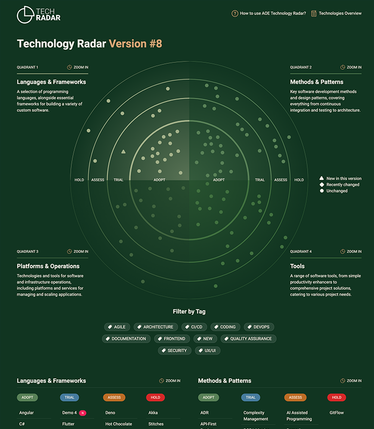

# technology_radar

A static site generator for Technology Radar



## create your own radar

The generator is free to use under Open Source License - in fact there are already some other Radars
published based on our Radar and there are also Contributions back. However, it would be nice to
mention in radar that the generator is based on this repository.

```bash
➜  technology_radar git:(main) ✗ nvm list
       v10.17.0
       v10.24.1
->     v16.13.2
       v16.14.0
       v18.12.0
         system
default -> 16.13 (-> v16.13.2)
iojs -> N/A (default)
unstable -> N/A (default)
node -> stable (-> v18.12.0) (default)
stable -> 18.12 (-> v18.12.0) (default)
lts/* -> lts/hydrogen (-> N/A)
lts/argon -> v4.9.1 (-> N/A)
lts/boron -> v6.17.1 (-> N/A)
lts/carbon -> v8.17.0 (-> N/A)
lts/dubnium -> v10.24.1
lts/erbium -> v12.22.12 (-> N/A)
lts/fermium -> v14.21.3 (-> N/A)
lts/gallium -> v16.20.2 (-> N/A)
lts/hydrogen -> v18.17.1 (-> N/A)
➜  technology_radar git:(main) ✗ nvm install v18.17.1
Downloading and installing node v18.17.1...
Downloading https://nodejs.org/dist/v18.17.1/node-v18.17.1-darwin-x64.tar.xz...
############################################################################################################################################################################################################################################# 100.0%
Computing checksum with sha256sum
Checksums matched!
Now using node v18.17.1 (npm v9.6.7)
➜  technology_radar git:(main) ✗ nvm use 18.17.1
Now using node v18.17.1 (npm v9.6.7)
```

### step 1: create a new project

Ensure Node.js ist installed and create a new project by creating a new folder with a `package.json`
file like the following and adapt to your needs:

```json
{
  "name": "aoe-techradar",
  "version": "1.0.0",
  "license": "MIT",
  "scripts": {
    "build": "techradar build",
    "serve": "techradar serve"
  },
  "dependencies": {
    "aoe_technology_radar": "^4"
  }
}
```

Run `npm install` to install the dependencies and run `npm run build` to create the initial radar.
This will also create a basic bootstrap of all required files, including the `config.json` and
the `about.md` if they do not exist yet.

### step 2: change logo and the favicon

Place your `logo.svg` and `favicon.ico` in the `public` folder next to the `package.json`.
The ideal logo is 150px x 60px. For reference have a look at [public/logo.svg](./public/logo.svg).

If you want to use a file other than an SVG, copy it to the `public` folder and set the name of the
file as `logoFile` inside the `config.json`. e.g. `"logoFile": "acme-logo.png"`

## step 3: configure the radar

Open the `config.json` file and configure the radar to your needs.

| Attribute | Description                                                                                                                    |
| --------- | ------------------------------------------------------------------------------------------------------------------------------ |
| basePath  | Set if hosting under a sub-path, otherwise set it to `/`. Default is `/techradar`                                              |
| baseUrl   | Set to the full URL, where the radar will be hosted. Will be used for sitemap.xml. `https://www.aoe.com/techradar`             |
| logoFile  | (optional) Filepath in public folder. Default is `logo.svg`                                                                    |
| toggles   | (optional) Modify the behaviour and contents of the radar. See config below.                                                   |
| sections  | (optional) Modify the order of sections (`radar`, `tags`, `list`)                                                              |
| colors    | A map of colors for the radar. Can be any valid CSS color value                                                                |
| quadrants | Config of the 4 quadrants of the radar. See config below.                                                                      |
| rings     | Config of the rings of the radar. See config below.                                                                            |
| flags     | Config of the flags of the radar. See config below                                                                             |
| chart     | If you hava a lot of items, you can increase the `size` to scale down the radar                                                |
| social    | Social links in the footer. See config below                                                                                   |
| imprint   | URL to the legal information                                                                                                   |
| labels    | Configure the labels to change the texts and labels of the radar                                                               |
| tags      | (optional) Use to render only items, which contain at least one of the specified tags. e.g `["frontend", "backend"]`           |
| editUrl   | (optional) If set, an edit button will be shown next to the revision.<br/> You can use placeholders for `{id}` and `{release}` |

#### `config.toggles`

| Attribute        | Description                                             |
| ---------------- | ------------------------------------------------------- |
| showChart        | Render the radar visualization on the homepage?         |
| showTagFilter    | Render the tag filter below the radar?                  |
| showQuadrantList | Render the items below the radar?                       |
| showEmptyRings   | If set to `true` it will render empty rings in the list |

#### `config.sections`

An array with of `radar`, `tags`, `list` in order you want them to appear on the page.

#### `config.quadrants`

| Attribute   | Description                                                 |
| ----------- | ----------------------------------------------------------- |
| id          | Used as reference in the radar Markdown files and URLs      |
| title       | Title of the quadrant                                       |
| description | Will be shown on startpage and on the quadrants detail page |
| color       | Color of the quadrant arcs and blips                        |

#### `config.rings`

| Attribute   | Description                                                                 |
| ----------- | --------------------------------------------------------------------------- |
| id          | Used as reference in the radar Markdown files                               |
| title       | Title of the ring. Will be used in the badge                                |
| description |                                                                             |
| color       | Color of the ring's badge                                                   |
| radius      | Size of the ring. Value between 0 and 1, where 0.5 would be a ring 50% wide |
| strokeWidth | Size of the ring's border                                                   |

#### `config.flags.[new|changed|default]`

| Attribute   | Description                                |
| ----------- | ------------------------------------------ |
| color       | Color of the flag                          |
| title       | Long label of the flag                     |
| titleShort  | Short label (single letter) shown in lists |
| description | Label in the radar legend                  |
